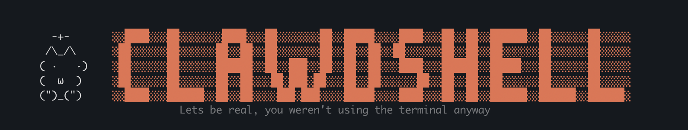

<p align="center">
  <br>
  
  
  
  
</p>

<p align="center">
  
</p>

<p align="center">
  A login shell that launches AI coding tools.<br>
  Open a terminal. Land in Claude Code. Or Codex. Or Gemini. Or Aider.<br>
  Your shell, your choice.
</p>

---

## Install

**macOS / Linux / WSL:**
```sh
curl -fsSL https://clawdshell.sh | sh
```

**Windows (PowerShell):**
```powershell
irm https://clawdshell.sh | iex
```

**Windows (CMD):**
```cmd
curl -fsSL https://clawdshell.sh/install.cmd -o install.cmd && install.cmd && del install.cmd
```

Or grab a binary from [Releases](https://github.com/coffecup25/clawdshell/releases) and run `clawdshell --install`.

## How it works

```
Terminal opens
  → ClawdShell launches your AI tool (claude, codex, gemini, ...)
  → When the tool exits, you drop to your regular shell
  → When that shell exits, the terminal closes
```

Zero friction. Zero delay. Your AI tool is always one terminal-open away.

## Your companion

Every installation hatches a unique ASCII companion from an egg.

```
  ╭─────────────────────────╮
  │   /\_/\       Mochi     │
  │  ( ·   ·)      ★★★     │
  │  (  ω  )       rare     │
  │  (")_(")                │
  ├─────────────────────────┤
  │ DEBUGGING  ████░ 8      │
  │ PATIENCE   ██░░░ 4      │
  │ CHAOS      █████ 10     │
  │ WISDOM     ███░░ 6      │
  │ SNARK      ████░ 7      │
  ╰─────────────────────────╯
```

See yours with `clawdshell --companion`. Reroll during setup if you want a different one.

## Configuration

Config lives at `~/.config/clawdshell/config.toml`:

```toml
[defaults]
tool = "claude"              # which tool to launch
fallback_shell = "/bin/zsh"  # shell to drop to after tool exits

[companion]
enabled = true
seed = "a7f2b3"             # determines your companion

[tools.claude]
args = ["--model", "opus"]

[tools.codex]
args = ["--full-auto"]

[tools.gemini]
command = "/usr/local/bin/gemini-cli"
```

## Supported tools

| Tool | Binary | Website |
|------|--------|---------|
| Claude Code | `claude` | [claude.ai/code](https://claude.ai/code) |
| Codex CLI | `codex` | [openai.com](https://openai.com) |
| Gemini CLI | `gemini` | [cloud.google.com](https://cloud.google.com) |
| OpenCode | `opencode` | [opencode.ai](https://opencode.ai) |
| Aider | `aider` | [aider.chat](https://aider.chat) |
| ForgeCode | `forge` | [forgecode.dev](https://forgecode.dev) |

Any binary works — just add a `[tools.<name>]` section to your config.

## Commands

```
clawdshell                     # launch (normal startup)
clawdshell --install           # setup wizard
clawdshell --uninstall         # restore previous shell
clawdshell --set-tool <name>   # switch default tool
clawdshell --companion         # show your companion
clawdshell -- --resume         # pass args to the tool
clawdshell -c "command"        # run command via fallback shell (ssh/scp compat)
```

## Uninstall

```bash
clawdshell --uninstall
```

Restores your previous shell. Config file is preserved.

## License

MIT

---

<p align="center">
  <sub>Built with Rust. Powered by your favorite AI.</sub>
</p>
